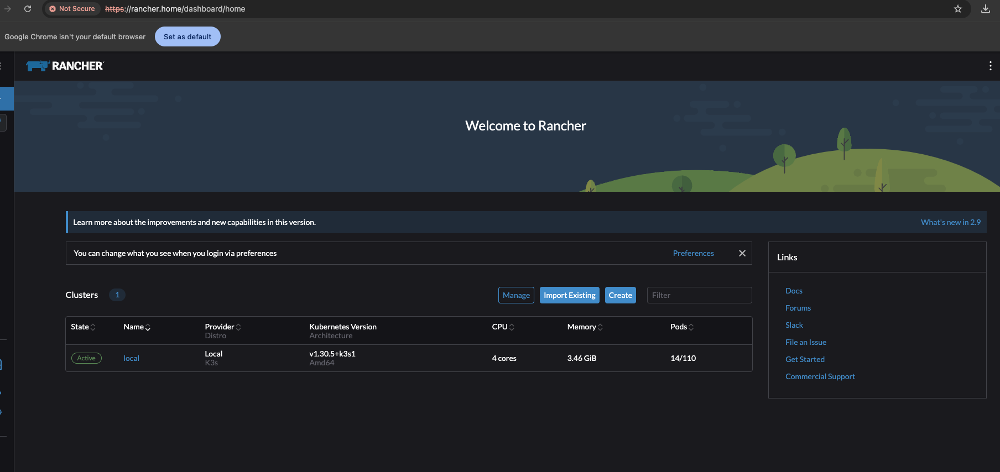

# Rancher-Deploy

This project automates the deployment of a **MicroOS VM** and installs **K3s**, **Helm**, **cert-manager**, and **Rancher** using **Terraform** and **Ansible**.

## Project Overview

1. **Terraform**: Provisions a **MicroOS VM**.
2. **Ansible**: 
   - Installs **K3s** on the provisioned VM.
   - Deploys **Helm**, **cert-manager**, and **Rancher**.

## Prerequisites

- **Terraform** 
- **Ansible** 
- **SSH Access**: The base image used by proxmox, has already my ssh key injected by cloud-init

## Setup

### Step 1: Configure Terraform

1. **Create a `credentials.auto.tfvars` file**:
   You need to create a `terraform/proxmox/credentials.auto.tfvars` file with your credentials for Terraform to connect to your Proxmox environment.

   Example `credentials.auto.tfvars`:

   ```hcl
   proxmox_api_url       = "https://your-proxmox-server:8006/api2/json"
   proxmox_api_token_id  = "root@pam!terraform" # check your own token id
   proxmox_api_token_secret = "your-proxmox-api-token"
   ```

2. **Run Terraform**:
   Change to the Terraform directory and initialize the Terraform modules:

   ```bash
   cd terraform/proxmox
   terraform init
   terraform apply
   ```

   This will provision the **MicroOS VM**.

### Step 2: Configure Ansible

1. **Inventory File**:
   You need to add your VM’s details to the Ansible inventory file. Example `inventory` file:

   ```ini
   [rancher_node]
   rancher_node ansible_host=192.168.0.11 ansible_user=root

   [rancher_node:vars]
   rancher_bootstrap_password="superduperpassword" # password used to login on rancher
   rancher_hostname="your-rancher-hostname" # it will be used by cert-manager, if you dont a name
                                            # use something like <IP_OF_LINUX_NODE>.sslip.io
   cert_manager_version="v1.16.1"
   ```

2. **Run the Ansible Playbook**:
   Run the Ansible playbook to install K3s, Helm, cert-manager, and Rancher:

   ```bash
   ansible-playbook -i inventory ansible/setup_rancher.yml
   ```

   This will install and configure:
   - **K3s**: Lightweight Kubernetes distribution.
   - **Helm**: Kubernetes package manager.
   - **cert-manager**: Automatically provisions and manages TLS certificates.
   - **Rancher**: Kubernetes management platform.

## Usage

Once the deployment is complete, you can access Rancher using the hostname or IP address you configured in the playbook.

```bash
$ kubectl --kubeconfig ansible/kubeconfig-remote.yaml get nodes
```

Verify that Rancher and cert-manager are up and running in your K3s cluster.

```bash
$ kubectl --kubeconfig kubeconfig-remote.yaml -n cattle-system get deploy rancher
NAME      READY   UP-TO-DATE   AVAILABLE   AGE
rancher   1/1     1            1           2m41s
```

If everything worked properly you will then get Rancher up and running :rocket:



## License

This project is licensed under the MIT License.

